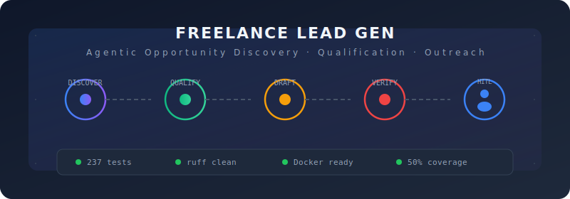
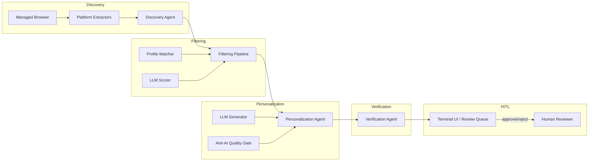

<p align="center">
  
</p>

# Freelance Lead Gen

> Agentic freelance opportunity discovery, qualification, and outreach preparation.

**Freelance Lead Gen** automates the discovery of freelance and contract opportunities across platforms like Upwork, LinkedIn, Freelancer, and job boards. It qualifies leads using a blend of rule-based scoring and LLM-powered analysis, generates personalised outreach drafts with anti-AI-detection quality gates, and presents everything in a terminal UI for human review before any action is taken.

---

## Getting Started

### 1. Get an API Key

This system uses an LLM (AI) to qualify leads and generate outreach drafts.
You need an API key from a supported provider:

- **[OpenCode](https://opencode.ai)** (recommended) — $10 free credit, no subscription
- **OpenAI** — standard API key
- Any OpenAI-compatible provider

### 2. One-Click Launch (Docker)

```bash
docker run -p 8080:8080 -e LLM_API_KEY=*** ghcr.io/iknowkungfubar/freelance-lead-gen
```

Then open http://localhost:8080 for health status.

### 3. Quickstart Wizard (Python)

```bash
pip install freelance-lead-gen
freelance-lead-gen quickstart
```

### 4. Manual Setup

Copy `.env.example` to `.env`, fill in your API key, then:

```bash
freelance-lead-gen init
freelance-lead-gen discover --dry-run
freelance-lead-gen serve
```

---

## Features

- **Multi-platform discovery** — automated scraping of Upwork, LinkedIn, Freelancer, and configurable job boards with platform-specific anti-bot profiles
- **AI-powered qualification** — LLM-driven skill/title/budget analysis with blended scoring (rule + AI) and tier assignment (HIGH / POTENTIAL / LOW)
- **Personalised outreach** — generates custom-tailored proposal drafts with anti-AI-detection quality gates to keep language natural
- **Verification pipeline** — readability scoring, banned-phrase scanning, AI-marker detection, and structural checks on every draft
- **Human-in-the-loop (HITL)** — all outreach drafts require manual review and approval in the terminal UI before anything is submitted
- **Stealth browser automation** — fingerprint rotation, human-like mouse movement, Gaussian jitter delays, and optional `playwright-stealth` integration to avoid platform detection
- **Configurable scheduling** — APScheduler-powered periodic discovery runs with configurable intervals and daily caps
- **50 leads/day target** — designed to process up to 50 qualified leads per day from a diverse set of search queries
- **Rich terminal UI** — dashboard, lead list, detail view, content editor, and review queue built with Textual
- **No autonomous submission** — the agent discovers, qualifies, drafts, and verifies — but never submits. All outbound actions must pass the HITL gate.

---

## Architecture

The system uses a phased pipeline architecture. Opportunities flow through each phase sequentially, with persistence to SQLite at every stage.



**Data flow:** Raw leads → Structured opportunities → Scored & tiered → Personalised drafts → Verified drafts → Human review → Approved for submission (manual).

---

## Quick Start

> **New user?** See the [Getting Started](#getting-started) section above for quick setup via Docker or the `quickstart` wizard.
>
> The instructions below are the full manual setup for development use.

```bash
# Clone the repository
git clone https://github.com/iknowkungfubar/freelance-lead-gen.git
cd freelance-lead-gen

# Install with uv (recommended)
uv venv
source .venv/bin/activate
uv sync

# Install Playwright browsers
playwright install chromium

# Copy and edit configuration
cp .env.example .env
# Edit .env with your LLM API key and platform credentials

# Initialize the database
freelance-lead-gen init

# Run discovery (optional — enriches as you configure)
freelance-lead-gen discover

# Launch the review TUI
freelance-lead-gen review

# Or run the full pipeline
freelance-lead-gen pipeline
```

> **Note:** Platform credentials (Upwork, LinkedIn, Freelancer) are optional. The system will work with public job boards without authentication. See [Platform Setup](#platform-setup) for details.

---

## Configuration

All configuration is managed via environment variables or a `.env` file in the project root. Copy `.env.example` to `.env` and fill in your values.

### LLM

| Variable | Default | Description |
|----------|---------|-------------|
| `LLM_PROVIDER` | `opencode` | Provider name (for logging / routing) |
| `LLM_MODEL` | `deepseek-v4-flash` | Model identifier |
| `LLM_BASE_URL` | `https://opencode.ai/zen/go/v1` | API base URL (OpenAI-compatible) |
| `LLM_API_KEY` | — | API key |
| `LLM_MAX_RETRIES` | `3` | Maximum API call retries |
| `LLM_TIMEOUT_SECONDS` | `120` | Request timeout in seconds |

### Browser

| Variable | Default | Description |
|----------|---------|-------------|
| `BROWSER_HEADLESS` | `false` | Run browser in headless mode |
| `BROWSER_USER_DATA_DIR` | `./browser_data` | Path to browser user data directory |
| `BROWSER_PROFILE_NAME` | `Default` | Browser profile name to use |
| `BROWSER_VIEWPORT_WIDTH` | `1920` | Default viewport width (px) |
| `BROWSER_VIEWPORT_HEIGHT` | `1080` | Default viewport height (px) |

### Discovery

| Variable | Default | Description |
|----------|---------|-------------|
| `DISCOVERY_MAX_DAILY` | `50` | Maximum opportunities to process per day |
| `DISCOVERY_SCHEDULE_INTERVAL_MINUTES` | `60` | Interval between discovery rounds (minutes) |
| `DISCOVERY_SEARCH_QUERIES` | `AI automation,AI readiness assessment,…` | Comma-separated search queries |

### Database

| Variable | Default | Description |
|----------|---------|-------------|
| `DATABASE_PATH` | `./data/leads.db` | SQLite database file path |
| `DATABASE_ECHO` | `false` | Log all SQL statements (debug) |
| `DATABASE_POOL_SIZE` | `5` | Connection pool size |
| `DATABASE_POOL_OVERFLOW` | `10` | Max overflow connections |

### HITL (Human-in-the-Loop)

| Variable | Default | Description |
|----------|---------|-------------|
| `HITL_ENABLED` | `true` | Enable HITL review gate |
| `HITL_AUTO_APPROVE` | `false` | Auto-approve outreach drafts without human review |
| `HITL_REVIEW_TIMEOUT_SECONDS` | `300` | Max seconds to wait for human review before skipping |

### Platforms

| Variable | Default | Description |
|----------|---------|-------------|
| `PLATFORMS_ENABLED` | `upwork,linkedin,freelancer` | Comma-separated list of enabled platforms |

### Platform Credentials

These are set via environment variables only (never hardcoded):

| Variable | Description |
|----------|-------------|
| `UPWORK_USERNAME` | Upwork account email/username |
| `UPWORK_PASSWORD` | Upwork account password |
| `LINKEDIN_USERNAME` | LinkedIn account email/username |
| `LINKEDIN_PASSWORD` | LinkedIn account password |
| `FREELANCER_USERNAME` | Freelancer.com account username |
| `FREELANCER_PASSWORD` | Freelancer.com account password |

> **Security:** Platform credentials are auto-redacted in all logs and output. See [Security](docs/security.md) for details.

---

## CLI Commands

| Command | Description |
|---------|-------------|
| `init` | Initialize the database and create the schema (idempotent) |
| `discover` | Run the discovery phase — search enabled platforms for new opportunities |
| `pipeline` | Run the full pipeline (discovery → filtering → personalization → verification → HITL) |
| `review` | Open the terminal UI focused on the review queue for draft approval |
| `list` | List opportunities with optional filters (status, platform, limit) |
| `stats` | Show aggregate pipeline statistics and platform breakdown |
| `quickstart` | Interactive first-time setup wizard — configure API key and platforms in under 2 minutes |
| `serve` | Start the scheduler daemon for periodic discovery runs |

```bash
freelance-lead-gen --help
freelance-lead-gen init
freelance-lead-gen list --status qualified --limit 20
freelance-lead-gen stats
```

---

## Platform Setup

### Upwork

1. Add your credentials to `.env`: `UPWORK_USERNAME` and `UPWORK_PASSWORD`
2. The Upwork extractor uses the standard search interface with authentication
3. Anti-bot profile: stealth enabled, human-like mouse movement, random delays

### LinkedIn

1. Add your credentials to `.env`: `LINKEDIN_USERNAME` and `LINKEDIN_PASSWORD`
2. The LinkedIn extractor uses keyword-based job search with pagination
3. Anti-bot profile: stealth enabled, conservative delays, session persistence

### Freelancer

1. Add your credentials to `.env`: `FREELANCER_USERNAME` and `FREELANCER_PASSWORD`
2. The Freelancer extractor uses the public project listing pages
3. Anti-bot profile: enhanced stealth with longer random delays

### Job Boards (Generic)

Job boards use the `GenericPlaywrightExtractor` with CSS-selector-based configuration. No authentication required for public boards. Configured via the `PLATFORMS_ENABLED` variable.

### Adding a New Platform

See the [development guide](docs/development.md#adding-a-new-platform) for step-by-step instructions on creating custom platform extractors.

---

## Safety & Human-in-the-Loop

The system is designed with **safety and human oversight** as a core principle:

- **The agent never submits anything autonomously** — it discovers, qualifies, drafts, and verifies, but all outbound communications require explicit human approval through the review queue
- **HITL review gate** — every outreach draft is presented in the terminal UI for review before it can be submitted
- **Draft versioning** — all draft changes are tracked with full version history; you can always see what changed
- **Banned phrase detection** — the verification agent scans for problematic language patterns before drafts reach review
- **Anti-AI content gates** — readability scoring and AI marker detection help keep generated content natural and avoid platform detection

> `HITL_AUTO_APPROVE=false` is the default and recommended setting.

---

## Development

```bash
# Install with dev dependencies
uv sync --group dev

# Run tests
pytest

# Run with coverage
pytest --cov=freelance_lead_gen --cov-report=term-missing

# Lint
ruff check src/

# Format
ruff format src/

# Type check
mypy src/
```

See the [development guide](docs/development.md) for detailed setup, testing conventions, and platform integration instructions.

---

## Project Structure

```
freelance-lead-gen/
├── src/freelance_lead_gen/
│   ├── cli.py                  # Click CLI entry point
│   ├── llm.py                  # LLM client (OpenAI-compatible)
│   ├── agents/                 # Pipeline agents
│   │   ├── orchestrator.py     # LeadGenOrchestrator
│   │   ├── filtering_agent.py  # Filtering & scoring
│   │   ├── personalization_agent.py  # Outreach draft generation
│   │   ├── verification_agent.py     # Quality & safety checks
│   │   └── profile_matcher.py  # Skill/title similarity scoring
│   ├── config/                 # Settings and prompt templates
│   │   ├── settings.py         # Pydantic models for all config
│   │   └── prompts.py          # LLM prompt templates
│   ├── discovery/              # Browser automation & extraction
│   │   ├── browser.py          # ManagedBrowser (Playwright wrapper)
│   │   ├── discovery_agent.py  # Coordination of extraction runs
│   │   ├── extractor.py        # GenericPlaywrightExtractor
│   │   ├── scheduler.py        # APScheduler periodic runner
│   │   └── platforms/          # Per-platform extractors
│   ├── models/                 # Pydantic domain models
│   │   ├── opportunity.py
│   │   ├── pipeline.py
│   │   └── platform.py
│   ├── storage/                # Database layer
│   │   ├── database.py         # SQLAlchemy async engine
│   │   ├── migrations.py       # Inline migration runner
│   │   └── repository.py       # OpportunityRepository
│   ├── ui/                     # Textual terminal UI
│   │   ├── app.py              # TUI application
│   │   ├── dashboard.py        # Dashboard screen
│   │   ├── lead_list.py        # Lead listing screen
│   │   ├── lead_detail.py      # Lead detail screen
│   │   ├── content_editor.py   # Draft editor screen
│   │   ├── review_queue.py     # Review queue screen
│   │   └── widgets.py          # Shared UI widgets
│   └── utils/                  # Utilities
│       ├── fingerprint.py     # Browser fingerprint generation
│       └── logging.py         # Structured logging config
├── tests/                      # Test suite
├── docs/                       # Documentation
│   ├── architecture.md
│   ├── development.md
│   └── security.md
└── .github/                    # CI/CD, issue templates
```

---

## License

MIT — see [LICENSE](LICENSE).

---

*Built with Playwright, SQLAlchemy, Textual, and structured LLM pipelines.*
