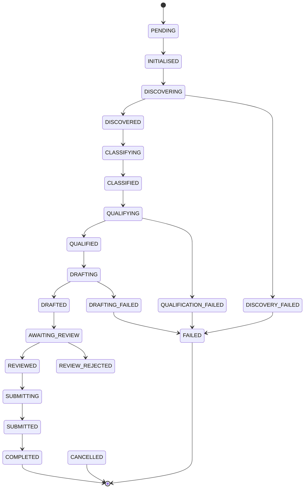
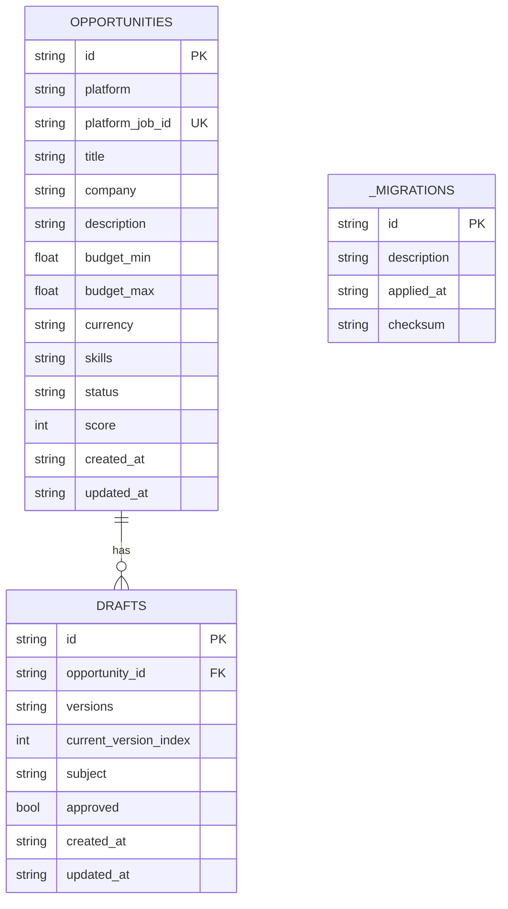

# System Architecture

> **freelance-lead-gen** — an agentic freelance opportunity discovery and outreach system.

---

## Overview

The system is built around a **phased pipeline** architecture. Each phase of the pipeline is represented by a distinct agent or service, and opportunities flow from one phase to the next via in-memory data structures and a shared SQLite database.

```
                ┌──────────┐     ┌──────────┐     ┌─────────────┐
                │Discovery │────▶│ Filtering│────▶│Personaliz.  │
                │  Agent   │     │ Pipeline │     │   Agent     │
                └──────────┘     └──────────┘     └─────────────┘
                      │                                │
                      ▼                                ▼
                ┌──────────┐     ┌──────────┐     ┌─────────────┐
                │  LLM     │◀────│   HITL   │◀────│Verification │
                │  Client  │     │  Review  │     │   Agent     │
                └──────────┘     └──────────┘     └─────────────┘
```

---

## Layer Diagram

```mermaid
graph TB
    subgraph CLI["CLI Layer"]
        CLI[Click CLI]
        TUI[Textual TUI]
    end

    subgraph Orchestration["Orchestration Layer"]
        ORCH[LeadGenOrchestrator]
        SCHED[DiscoveryScheduler]
    end

    subgraph Agents["Agent Layer"]
        DA[DiscoveryAgent]
        FP[FilteringPipeline]
        PA[PersonalizationAgent]
        VA[VerificationAgent]
        PM[ProfileMatcher]
    end

    subgraph Extraction["Extraction Layer"]
        MB[ManagedBrowser]
        PL[Platform Extractors]
        EX[GenericPlaywrightExtractor]
    end

    subgraph Storage["Storage Layer"]
        DB[(SQLite Database)]
        REPO[OpportunityRepository]
        MIG[Migration Runner]
    end

    subgraph Models["Domain Models"]
        LO[LeadOpportunity]
        OD[OutboundDraft]
        PC[PipelineContext]
        PR[PipelineResult]
        LS[LeadScoringResult]
        VR[VerificationResult]
    end

    subgraph Config["Configuration"]
        SETT[Settings]
        PROMPTS[Prompt Templates]
    end

    CLI --> ORCH
    TUI --> REPO
    ORCH --> DA
    ORCH --> FP
    ORCH --> PA
    ORCH --> VA
    DA --> MB
    DA --> PL
    PL --> EX
    EX --> MB
    FP --> PM
    FP --> LLM[LLMClient]
    PA --> LLM
    VA --> LLM
    ORCH --> REPO
    DA --> REPO
    FP --> REPO
    PA --> REPO
    REPO --> DB
    MIG --> DB
    All --> SETT
```

---

## Pipeline Flow



---

## Key Components

### 1. CLI Layer

| Component | Description |
|-----------|-------------|
| `cli.py` | Click-based CLI with commands: `init`, `discover`, `pipeline`, `review`, `list`, `stats`, `serve` |
| `ui/` | Textual-based TUI for interactive lead review and dashboard |

### 2. Orchestration Layer

| Component | Description |
|-----------|-------------|
| `orchestrator.py` | `LeadGenOrchestrator` — central state machine that coordinates all pipeline phases |
| `scheduler.py` | `DiscoveryScheduler` — APScheduler-based periodic discovery runner |

### 3. Agent Layer

| Component | Description |
|-----------|-------------|
| `discovery_agent.py` | `DiscoveryAgent` — runs platform extractors, deduplicates, persists new leads |
| `filtering_agent.py` | `FilteringPipeline` — rule-based + LLM scoring, tier assignment (HIGH/POTENTIAL/LOW) |
| `profile_matcher.py` | `ProfileMatcher` — skill/title/budget/experience similarity scoring |
| `personalization_agent.py` | `PersonalizationAgent` — generates outreach drafts with anti-AI quality gates |
| `verification_agent.py` | `VerificationAgent` — readability, banned-phrase, AI-marker, and structural checks |

### 4. Extraction Layer

| Component | Description |
|-----------|-------------|
| `browser.py` | `ManagedBrowser` — Playwright wrapper with stealth, jitter, session persistence |
| `extractor.py` | `GenericPlaywrightExtractor` — CSS-selector-based scraping for any platform |
| `platforms/` | Pre-configured extractors for Upwork, LinkedIn, Freelancer, and generic job boards |

### 5. Storage Layer

| Component | Description |
|-----------|-------------|
| `database.py` | SQLAlchemy async engine, session management, WAL mode, connection pragmas |
| `migrations.py` | Inline migration runner (no Alembic dependency) with registry table |
| `repository.py` | `OpportunityRepository` — full CRUD, upsert (dedup), search with FTS5, stats |

### 6. Domain Models

All models are **Pydantic v2** classes defined under `models/`:

- **`LeadOpportunity`** — central entity: platform, title, description, budget, skills, status, score
- **`OutboundDraft`** — versioned outreach message with approval tracking
- **`LeadScoringResult`** — structured LLM scoring output (qualified, score, reasoning, risks)
- **`PipelineContext`** — per-opportunity pipeline state machine with transition validation
- **`PipelineResult`** — aggregated pipeline run report
- **`VerificationResult`** — quality check output (readability, banned phrases, AI markers)

---

## Data Flow Through the Pipeline

```
1. DISCOVERY
   ManagedBrowser → PlatformExtractor → RawLead → upsert to DB

2. FILTERING
   LeadOpportunity → ProfileMatcher (rule score)
                   → LLMClient (structured classification)
                   → blended score → tier assignment → persist

3. PERSONALIZATION
   LeadOpportunity + TargetProfile → LLMClient (draft generation)
   → anti-AI quality check → OutboundDraft → persist

4. VERIFICATION
   OutboundDraft → banned phrase regex → readability → structure
   → optional LLM pass → VerificationResult

5. HITL REVIEW
   (Textual TUI) → human approves/rejects → status update → persist
```

---

## Database Schema



---

## Security Architecture

- **Credentials** are stored in `PlatformCredentials` with automatic redaction on serialisation
- **API keys** are loaded via environment variables / `.env` file (never hardcoded)
- **Browser user data** is stored in a local directory excluded from version control (`.gitignore`)
- **Secrets are never logged**: `PlatformCredentials.model_dump()` redacts `password`, `api_key`, `token`, and `cookies`
- **SQLite database** is excluded from version control (`.gitignore`)

See [security.md](security.md) for a full security review.

---

## Concurrency Model

- **SQLAlchemy async engine** with aiosqlite for non-blocking database access
- **Semaphore-controlled LLM calls** (`asyncio.Semaphore(5)`) to prevent API rate-limit floods
- **Session-level event loop** fixture (pytest-asyncio) for test isolation
- **Connection pool** with configurable size and overflow (default: 5/10)
- **WAL mode** for concurrent reads during writes

---

## Error Handling Strategy

| Layer | Strategy |
|-------|----------|
| Orchestrator | Per-phase try/except with partial completion, `OrchestratorReport` captures all errors |
| Agents | Individual opportunity isolation — one failure does not block the batch |
| Repository | Exceptions wrapped in `DatabaseError` with original preserved |
| LLM | Exponential backoff retry (3×), specific exception types per error mode |
| Browser | Retry with backoff, graceful abort, context manager cleanup |
